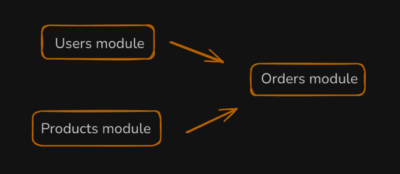
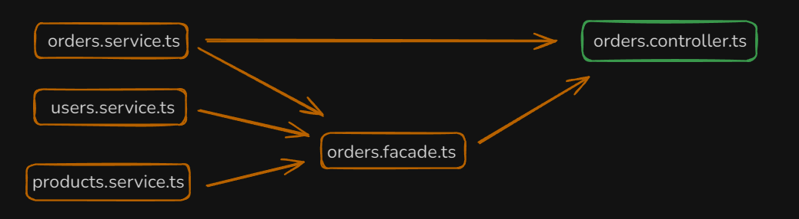
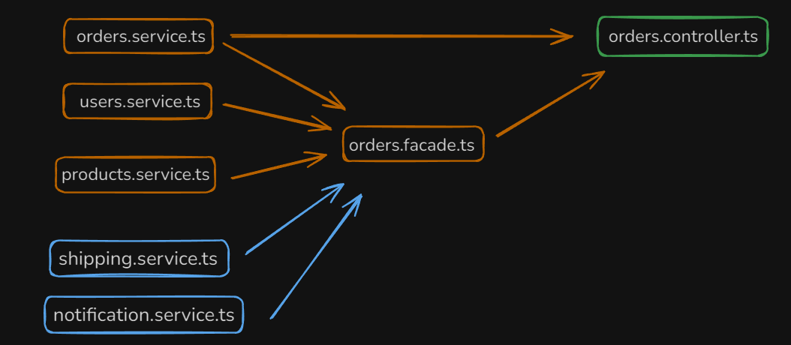

# Patrón Facade
La idea de este repo es mostrar de forma simple como podemos desacoplar la lógica para que nuestro proyecto sea más legible, escalable y mantenible a largo plazo.

Veamos un ejemplo práctico. Tenemos un proyecto e-commerce, el cuál tiene 3 módulos:



``UsersModule`` y ``ProductsModule`` son independientes, pero ``OrdersModule`` depende de ambos Modules para poder implementar diferentes casos de uso, como por ejemplo, crear una nueva Order. 

Si quiero crear una order necesito: 
- Chequear que el usuario exista.
- Chequear que los productos existan.
- Calcular el total de la order.
- Crear la order.

Cada module tiene los siguientes archivos:
- un controller.ts
- un service.ts
- un module.ts
- un dto.ts
- un schema.ts

Si queremos mantener la lógica limpia, cada ``service`` de cada ``module`` SOLO se debe encargar de manejar la lógica de interacción con la base de datos de su determinado modelo (Users, Products, Orders).
Aquí surge nuestro problema. El OrdersModule necesita interactuar con los services de los otros modules. 
¿Cómo logramos esta interacción sin romper la independencia entre los modules? 

Si inyectamos directamente los services de ``UsersModule`` y ``ProductModule`` en el ``orders.service.ts`` estamos acoplando los servicios, esto NO es recomendable porque nuestro service de orders SOLO debe manejar la lógica relacionada con la interacción con la base de datos de su modelo (Orders)

Aquí es donde implementamos el patrón facade. El cuál nos permite desacoplar la lógica de interacción de los diferentes services a un archivo específico, el cuál va a interactuar con el controller brindándole la lógica que necesita para poder resolver un determinado caso de uso sin que el cliente (el controller) se entere de que está pasando por detrás, solo le importa el resultado (la creación de la order)

El esquema quedaría así:


Nuestro ``orders.facade.ts`` no es más que un service especial en el cuál interactuan los diferentes services que se requieren para completar una determinada tarea, desacomplando así, la lógica del ``orders.service.ts``

Esto da muchas ventajas:
- Código limpio, se entiende con mayor facilidad.
- Código mantenible
- Código desacoplado, el orders.service puede seguir creciendo sin tener que modificar el facade.

<br>

---

<br>

¿Por qué el ``orders.controller`` está relacionado con ``orders.service`` y ``orders.facade``?

Sencillo, **``porque el facade SOLO se encarga de los casos de uso que involucran a más de un módulo.``** El orders.service se encarga de la lógica de los casos de uso que solo están relacionados con su propio módulo.

Veamos con ejemplos de casos de uso para que quede más claro:

- CreateOrder (facade, requiere de los otros modules)
- getOrderById(orderService, no requiere de los otros modules)
- addNewProductToOrder(facade, requiere de los otros modules)
- deleteOrderById(orderService, no requiere de los otros modules)

<br>

## Ejemplo en código

En nuestro ``order.service.ts`` manejamos la lógica de interacción directa con la base de datos

```

  create(createOrderDto: CreateOrderServiceDto) {
    return this.productModel.create(createOrderDto);
  }

  findOne(id: string) {
    return this.productModel.findById(id).populate({path:'user',model:'Users'}).populate({path:'products',model:'Products'});
  }

  remove(id: string) {
    return this.productModel.findByIdAndDelete(id);
  }

```

<br>

En el ``orders.facade.ts`` primero inyectamos todos los services que vamos a necesitar:

```
  private  ordersService: OrdersService;
  private  productsService: ProductsService;
  private  usersService: UsersService;

  constructor(private readonly moduleRef: ModuleRef) {
  }

  onModuleInit() {
    this.ordersService = this.moduleRef.get(OrdersService, { strict: false });
    this.productsService = this.moduleRef.get(ProductsService, { strict: false });
    this.usersService = this.moduleRef.get(UsersService, { strict: false });
  }

```

<br>

Luego  desarrollamos el método que manejara el caso de uso de creación de una order:

```
 async createOrder(dto: CreateOrderDto):Promise<OrdersDocument> {
    //check user 
  const user = await this.checkUser(dto.user);
   
   //check products
   const { products, availableProducts } = await this.checkProducts(dto.products);

   //get total
   const total = this.getTotalPrice(products);

   // create order
   const order = await this.ordersService.create({ user: dto.user, products: availableProducts, total });
   if (order) {
     order.user = user;
     order.products = products;
   }
   return order;

  }

```
**NOTA:** Acá también estamos haciendo uso del ``principio de responsabilidad única``, el cuál nos recomienda que cada método/función, solo debe realizar una única tarea para mantener el código legible, escalable y debuggeable. 


Los métodos que le dan soporte a nuestro createOrder los desarrollamos más abajo en el mismo facade:

```
 /*  UTILS */

  async checkProducts(productIds: string[]):
    Promise<{
    products: ProductsDocument[],
    availableProducts: string[]
  }> {
    
   const products: ProductsDocument[] = [];
   const availableProducts: string[] = [];

    for await (let id of productIds) {
      const prod = await this.productsService.findOne(id);
      if (prod) {
        availableProducts.push(id);
        products.push(prod);
      }
   }
   
    if (products.length === 0) throw new BadRequestException("Order has no available products");
    
   return {products,availableProducts}

  }

  getTotalPrice(products: ProductsDocument[]):number {
    let total = 0;

    products.forEach(product => {
      total += product.price;
    });
    return total;
  }

  async checkUser(userId:string):Promise<UsersDocument> {
    const user = await this.usersService.findById(userId);
    if (!user) throw new NotFoundException('User not found');
    return user;
  }
```

Cada uno de esos métodos cumple una sola función y son reutilizables, lo cuál también cumple con otro principio del desarrollo llamado ``DRY (Don't repeat yourself)``.

Bien, ahora que ya tenemos la lógica implementada, tenemos que inyectar el ``orders.service`` y el ``orders.facade`` en el controller.

```
 constructor(private readonly ordersService: OrdersService, private readonly ordersFacade: OrdersFacade) { }
```

Ahora los endpoints pueden hacer uso de uno service u otro en función de la tarea que requiera:

```
  // HACE USO DEL FACADE
  @Post()
 async create(@Body() createOrderDto: CreateOrderDto) {
    const order =  await this.ordersFacade.createOrder(createOrderDto);

    return {statusCode:HttpStatus.CREATED, result:{order}};
  }

// HACE USO DEL ORDERS SERVICE
  @Get(':id')
 async findOne(@Param('id') id: string) {
    const order = await this.ordersService.findOne(id);
    
    if (!order) throw new NotFoundException('Order not found');

    return {statusCode:HttpStatus.OK, result:{order}};
  }

// HACE USO DEL ORDERS SERVICE
  @Delete(':id')
  remove(@Param('id') id: string) {
    return this.ordersService.remove(id);
  }
```

<br>

## Escalabilidad

Esta es la forma más limpia para escalar el proyecto. Supongamos que nuestro proyecto crece y luego agregamos 2 módulos nuevos. Un ``ShippingModule`` y un ``NotificationModule``, y queremos que cada vez que se cree una nueva order se envíe una notificación por email o por push a la web. Ademas, con el shipping module queremos disparar el envío. Esto, nos permite agregar fácilmente los services a nuestro ``facade`` SIN tocar el ``orders.service``, que solo se encarga su proposito (interactuar con su modelo de base de datos)




